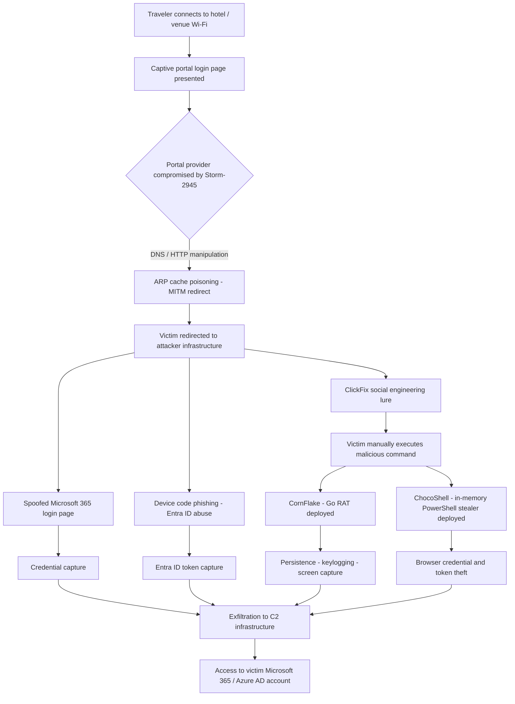
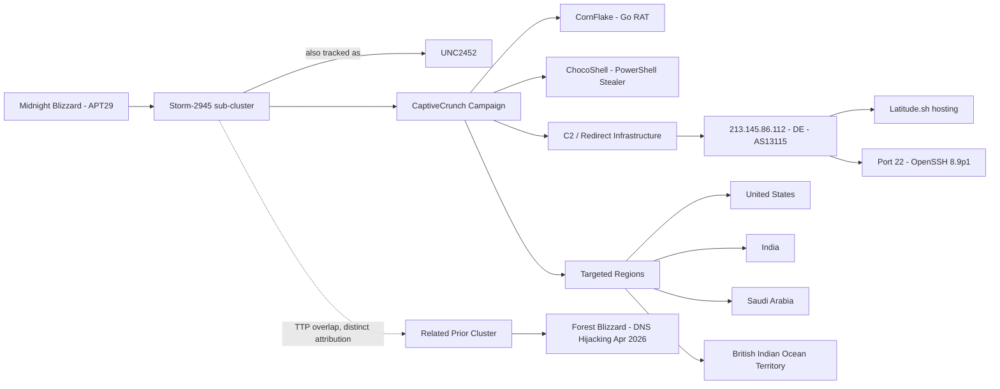
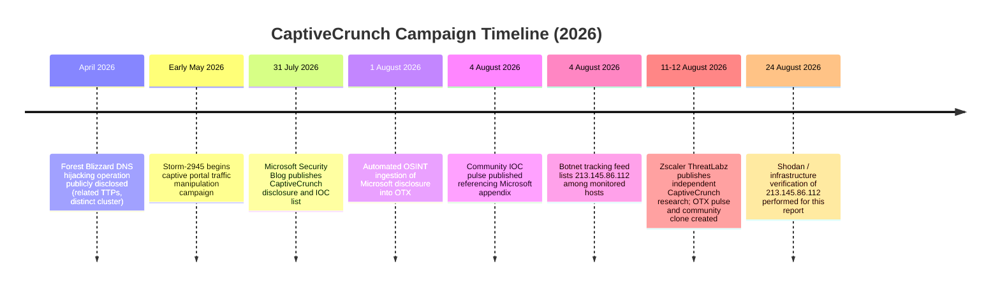

[README.md](https://github.com/user-attachments/files/31384314/README.md)
<p align="center">
  
</p>

<h1 align="center">Threat Intelligence Report</h1>
<h2 align="center">Operation CaptiveCrunch — Midnight Blizzard (APT29 / Storm-2945 / UNC2452)</h2>
<p align="center"><i>Hotel Wi-Fi Captive Portal Compromise for Microsoft 365 Credential Theft</i></p>

---

## Document Control

| Field | Value |
|---|---|
| Report title | Operation CaptiveCrunch — Midnight Blizzard Captive Portal Campaign |
| Classification | TLP:WHITE / TLP:GREEN (source material) |
| Prepared for | Internal Threat Intelligence Review |
| Analysis basis | OSINT correlation, OTX/AlienVault pulses, Shodan, VirusTotal, ANY.RUN |
| Report date | 2026-08-24 |
| Threat actor | Midnight Blizzard (APT29 / Cozy Bear), sub-cluster Storm-2945 |
| Tracked as | UNC2452 (Mandiant), Storm-2945 (Microsoft), APT29 (MITRE) |
| Campaign name | CaptiveCrunch |
| Primary malware | CornFlake (Go-based RAT), ChocoShell (in-memory PowerShell stealer) |

---

## 1. Executive Summary

This report documents the investigation of a sample set and supporting indicators of compromise (IOCs) linked to a credential-theft campaign publicly tracked as **CaptiveCrunch**, attributed with high confidence to **Midnight Blizzard** (APT29 / Cozy Bear), operating through the sub-cluster designated **Storm-2945** by Microsoft Threat Intelligence and **UNC2452** by Mandiant/OTX contributors.

The campaign manipulates DNS and HTTP traffic on shared **captive portal infrastructure** used by hotels, conference centers, and hospitality venues to redirect travelers to attacker-controlled infrastructure. Victims are served phishing pages that harvest **Microsoft 365 credentials**, abuse the **Microsoft Entra ID device code authentication flow**, and deliver malware through **ClickFix**-style social engineering. The operation has since expanded to target **Android** devices via malicious APK files.

Two malware families anchor the intrusion set:

- **CornFlake** — a Go-based Remote Access Trojan (RAT) providing persistent access and extensive host/network surveillance capability.
- **ChocoShell** — an in-memory PowerShell stealer that harvests browser-stored credentials, Microsoft 365 session tokens, and Azure AD tokens.

Infrastructure analysis of one of the associated hosts, **213.145.86.112**, places the node in Germany under ASN **AS13115 (Home of the Brave Internet Technology Based Solutions GmbH)**, fronted operationally through **Latitude.sh**, exposing only OpenSSH 8.9p1 on port 22. Cross-referenced OSINT (OTX AlienVault) links this IP to six independent pulses discussing the CaptiveCrunch operation and related botnet/malware-filter tracking lists.

The techniques observed align tightly with prior Midnight Blizzard tradecraft, including similarities to the **Forest Blizzard DNS hijacking** operation disclosed in April 2026, though attribution analysts assess CaptiveCrunch as a distinct Storm-2945 operation rather than a continuation of that cluster.

---

## 2. Threat Actor Attribution

| Attribute | Detail |
|---|---|
| Actor (common name) | Midnight Blizzard / Cozy Bear |
| MITRE designation | APT29 |
| Microsoft designation | Storm-2945 (sub-cluster of Midnight Blizzard) |
| Mandiant / OTX designation | UNC2452 |
| Suspected sponsor | State-sponsored (historically attributed to Russian intelligence services in prior public reporting) |
| Related historical operations | Forest Blizzard DNS hijacking (April 2026) — TTP overlap noted, but treated as a separate cluster |
| Targeting scope | Individuals of interest across government, diplomatic, and traveling-professional sectors |

Attribution is corroborated by multiple independent OSINT sources, including Zscaler ThreatLabz and Microsoft Security Response Center (MSRC), both of which independently converge on the Storm-2945 / Midnight Blizzard link.

---

## 3. Campaign Overview — CaptiveCrunch

Since early **May 2026**, Storm-2945 has conducted widespread, targeted **traffic manipulation attacks** against hospitality-sector networks that rely on shared, third-party captive portal providers. Rather than compromising individual hotel networks directly, the actor appears to have compromised **upstream captive portal service providers**, allowing a single point of access to redirect victims across many physical venues simultaneously.

Affected captive portal gateways have been identified in multiple U.S. cities, as well as in **India** and **Saudi Arabia**, with targeting also recorded against interests connected to the **British Indian Ocean Territory**.

### 3.1 Attack Chain Summary

1. A traveler connects to hotel or venue Wi-Fi and is presented with a captive portal login page.
2. DNS/HTTP responses on the compromised captive portal infrastructure are manipulated (ARP cache poisoning / man-in-the-middle) to redirect the victim to attacker-controlled infrastructure.
3. The victim is served a spoofed Microsoft 365 login page or a **device code phishing** prompt abusing the legitimate Microsoft Entra ID authentication flow.
4. In parallel, **ClickFix**-style social engineering lures the victim into manually executing a malicious command, dropping **CornFlake** (Go RAT) or triggering **ChocoShell** (in-memory PowerShell stealer).
5. CornFlake establishes persistence and surveillance capability (screen capture, keylogging, command execution); ChocoShell performs in-memory credential and token theft without writing a payload to disk.
6. Harvested Microsoft 365 credentials, session cookies, and Azure AD tokens are exfiltrated to actor-controlled command-and-control (C2) infrastructure.
7. The campaign has since been extended to Android devices via malicious APK delivery, broadening the victim surface beyond laptop/Wi-Fi clients.

---

## 4. Malware Families

### 4.1 CornFlake — Go-based Remote Access Trojan

| Property | Detail |
|---|---|
| Language | Go |
| Type | Remote Access Trojan (RAT) |
| Capabilities | Persistence, screen capture, keylogging, command and scripting interpreter execution, process injection, defense impairment |
| Delivery | ClickFix social engineering, malicious image/lure execution |
| Platforms | Windows; campaign extension observed toward Android (APK) |

### 4.2 ChocoShell — In-Memory PowerShell Stealer

| Property | Detail |
|---|---|
| Language | PowerShell |
| Type | In-memory / fileless credential stealer |
| Capabilities | Browser-stored credential theft, Microsoft 365 token theft, Azure AD token theft, session cookie theft |
| Defense evasion | Obfuscated/encoded execution, disables or modifies security tooling, deobfuscates payloads at runtime |
| Delivery | PowerShell command execution via ClickFix lure |

---

## 5. MITRE ATT&CK Technique Mapping

| Technique ID | Technique Name |
|---|---|
| T1566 | Phishing |
| T1566.002 | Spearphishing Link |
| T1204 | User Execution |
| T1204.003 | Malicious Image |
| T1059 | Command and Scripting Interpreter |
| T1059.001 | PowerShell |
| T1059.003 | Windows Command Shell |
| T1557 | Man-in-the-Middle |
| T1557.002 | ARP Cache Poisoning |
| T1528 | Steal Application Access Token |
| T1539 | Steal Web Session Cookie |
| T1056 | Input Capture |
| T1056.001 | Keylogging |
| T1113 | Screen Capture |
| T1027 | Obfuscated Files or Information |
| T1140 | Deobfuscate/Decode Files or Information |
| T1055 | Process Injection |
| T1548 | Abuse Elevation Control Mechanism |
| T1548.002 | Bypass User Account Control |
| T1562 | Impair Defenses |
| T1562.001 | Disable or Modify Tools |

---

## 6. Attack Chain Diagram



## 7. Threat Actor / Infrastructure Relationship Diagram



---

## 8. Infrastructure Analysis

### 8.1 Indicator: 213.145.86.112

| Field | Value |
|---|---|
| IP address | 213.145.86.112 |
| Country | Germany (DE) |
| ASN | AS13115 — Home of the Brave Internet Technology Based Solutions GmbH |
| ISP / Hosting | Latitude.sh |
| Open service | Port 22 — SSH-2.0-OpenSSH_8.9p1 Ubuntu-3ubuntu0.16 |
| Host key type | ecdsa-sha2-nistp256 |
| Host key fingerprint | 4e:e1:f6:88:90:30:ac:fe:42:ec:df:57:41:8a:1e:f2 |
| Operating system | Linux (Ubuntu) |
| Reported geolocation (Shodan) | New York City, NY, US (hosting network geolocation, distinct from RIR country registration of DE) |
| Category tag (OSINT) | REMOTE_ACCESS |
| AlienVault OTX reputation score | 0 |
| Associated OTX pulses | 6 |

The discrepancy between the RIR-registered country (Germany) and the Shodan-reported network geolocation (New York City, US) is consistent with infrastructure hosted through a distributed hosting provider (Latitude.sh) that operates data centers across multiple regions; the AS-level registration and the physical point-of-presence do not necessarily match.

### 8.2 SSH Key Exchange Algorithms Observed

```
curve25519-sha256
curve25519-sha256@libssh.org
ecdh-sha2-nistp256
ecdh-sha2-nistp384
ecdh-sha2-nistp521
sntrup761x25519-sha512@openssh.com
diffie-hellman-group-exchange-sha256
diffie-hellman-group16-sha512
diffie-hellman-group18-sha512
diffie-hellman-group14-sha256
kex-strict-s-v00@openssh.com
```

### 8.3 Shodan Host Summary

<p align="center">
  
</p>

*Figure 1 — Shodan host record for 213.145.86.112, showing the open SSH service, OS fingerprint (Canonical Linux), and network registration under Latitude.sh / AS396356.*

---

## 9. OSINT Correlation — AlienVault OTX Pulses

Six independent OTX pulses reference the indicator **213.145.86.112**, summarized below:

| Pulse Name | Author | Indicators | TLP | Notes |
|---|---|---|---|---|
| CaptiveCrunch: Midnight Blizzard Weaponizes Hotel Wi-Fi Captive Portals to Steal Microsoft 365 Credentials | AlienVault (official) | 16 | White | Primary reference pulse, sourced from Zscaler ThreatLabz research |
| CaptiveCrunch: Midnight Blizzard Weaponizes Hotel Wi-Fi Captive Portals to Steal Microsoft 365 Credentials (clone) | Tr1sa111 | 16 | White | Community clone of the primary Zscaler-sourced pulse |
| EbeeAug2026 Pt1 | IMEBEEIMFINE | 954 | White | Broad multi-actor IOC aggregation (includes XCSSET, M365 AiTM PhaaS, DOUBLECUP, Phantom Mantis, Phorpiex, and this campaign) |
| IOC - CaptiveCrunch: Midnight Blizzard targets travelers worldwide | celestre | 16 | White | Sourced from Microsoft Security Blog IOC appendix |
| Malware Filter - Botnet List - 03-08-2026 (Part 5) | CyberHunterAutoFeed | 500 | Green | Automated botnet tracking feed; IP appears among 500 tracked addresses |
| CaptiveCrunch: Midnight Blizzard targets travelers worldwide for malware delivery and credential theft [Microsoft Security Blog] | alienyvss | 8 | Green | Automated RSS ingestion of the Microsoft Security Blog disclosure |

### 9.1 Primary Open-Source References

- Zscaler ThreatLabz — CaptiveCrunch: Midnight Blizzard Weaponizes Hotel Wi-Fi Captive Portals to Steal Microsoft 365 Credentials
- Microsoft Security Blog (31 July 2026) — CaptiveCrunch: Midnight Blizzard targets travelers worldwide for malware delivery and credential theft
- Google Cloud Blog — Distinct clusters target individuals of interest to Russia
- malware-filter.gitlab.io — Botnet IP tracking feed

---

## 10. Sandbox and Multi-Scanner Analysis

Two related sample submissions were identified on ANY.RUN, and cross-referenced against VirusTotal reputation data for the associated indicators.

### 10.1 ANY.RUN Sandbox Report

<p align="center">
  
</p>

*Figure 2 — ANY.RUN interactive sandbox execution trace for a submitted CaptiveCrunch-related sample, showing process behavior and network activity consistent with ChocoShell / CornFlake tradecraft.*

Sample report references:

- `https://any.run/report/be99857449d2856dd5a84e21c8a3d5e0e01456adb44062ddec5a6b4970d8d42c/ae20850a-ff31-4bca-a1e9-0dd46b450d65`
- `https://any.run/report/918fa52ae45ed60ba7cc8bdc99c3cbe9ab92e0375ec31fc05d0d4513be11c593/a096c91c-e3f7-4014-9dad-e42ed69cf062`

### 10.2 VirusTotal Reputation Summary

<p align="center">
  
</p>

*Figure 3 — VirusTotal multi-engine scan summary for a sample associated with the CaptiveCrunch intrusion set.*

---

## 11. Infrastructure Timeline



---

## 12. Indicators of Compromise (IOC) Summary

| Type | Value | Source |
|---|---|---|
| IPv4 | 213.145.86.112 | Shodan, OTX (6 pulses) |
| ASN | AS13115 / AS396356 | Shodan, OTX |
| Hosting provider | Latitude.sh | Shodan |
| SSH fingerprint | 4e:e1:f6:88:90:30:ac:fe:42:ec:df:57:41:8a:1e:f2 | Shodan |
| Malware family | CornFlake (Go RAT) | Zscaler, Microsoft, OTX |
| Malware family | ChocoShell (PowerShell stealer) | Zscaler, Microsoft, OTX |
| ANY.RUN report | be99857449d2856dd5a84e21c8a3d5e0e01456adb44062ddec5a6b4970d8d42c | ANY.RUN |
| ANY.RUN report | 918fa52ae45ed60ba7cc8bdc99c3cbe9ab92e0375ec31fc05d0d4513be11c593 | ANY.RUN |

Note: additional file hashes (MD5 / SHA1 / SHA256), domains, and URLs referenced in the underlying OTX pulses (16-954 indicators per pulse) were not individually reproduced in this report; analysts should pull the full IOC sets directly from the cited pulses and the Microsoft Security Blog appendix before deploying blocking rules, since several of the aggregated pulses (e.g. "EbeeAug2026 Pt1") bundle indicators from multiple, unrelated threat clusters.

---

## 13. Detection and Mitigation Recommendations

1. **Network segmentation on captive portals** — treat all captive portal networks (hotel, airport, conference Wi-Fi) as untrusted; require VPN tunneling before any authentication flow is initiated.
2. **Disable device code authentication flow** where not operationally required, or apply strict Conditional Access policies restricting device code sign-in to managed devices and trusted locations.
3. **Block or alert on ClickFix-style execution patterns** — monitor for user-initiated `Win+R`, PowerShell, or terminal paste-and-run sequences triggered from browser-rendered instructions.
4. **Monitor for ARP cache poisoning indicators** on shared network segments serving captive portals.
5. **Egress filtering / C2 blocking** — add 213.145.86.112 and related infrastructure identified in the referenced OTX pulses to network and endpoint blocklists, subject to validation.
6. **Endpoint telemetry** — hunt for in-memory PowerShell execution consistent with ChocoShell (no payload written to disk, direct access to browser credential stores and Microsoft 365/Azure AD token caches).
7. **Mobile device management (MDM)** — restrict sideloading of APKs on managed Android devices used by traveling personnel, given the campaign's expansion to mobile targets.
8. **User awareness training** focused specifically on hotel/travel Wi-Fi risk and recognition of device code phishing prompts.

---

## 14. Conclusion

The evidence gathered across Shodan, AlienVault OTX, ANY.RUN, and VirusTotal converges consistently on a single conclusion: the samples and infrastructure under review belong to the **CaptiveCrunch** campaign, operated by **Storm-2945**, a sub-cluster of **Midnight Blizzard (APT29)**. The operation represents a notable evolution in Russian state-sponsored tradecraft, shifting from direct network intrusion toward **supply-chain-style compromise of shared hospitality infrastructure**, enabling mass-scale, low-cost targeting of traveling individuals of interest across government, diplomatic, and corporate sectors.

Given the active status of the campaign (samples and infrastructure activity observed as recently as August 2026) and its demonstrated expansion to Android, continued monitoring of the associated IOCs and TTPs is strongly recommended.

---

## 15. References

- Google Cloud Blog — Distinct clusters target individuals of interest to Russia: `https://cloud.google.com/blog/topics/threat-intelligence/distinct-clusters-target-individuals-of-interest-to-russia`
- Zscaler ThreatLabz — CaptiveCrunch: Midnight Blizzard Weaponizes Hotel Wi-Fi Captive Portals to Steal Microsoft 365 Credentials: `https://www.zscaler.com/blogs/security-research/captivecrunch-midnight-blizzard-weaponizes-hotel-wi-fi-captive-portals`
- Microsoft Security Blog — CaptiveCrunch: Midnight Blizzard targets travelers worldwide for malware delivery and credential theft: `https://www.microsoft.com/en-us/security/blog/2026/07/31/captivecrunch-midnight-blizzard-targets-travelers-worldwide-for-malware-delivery-and-credential-theft/`
- Shodan — Host record for 213.145.86.112: `https://www.shodan.io/host/213.145.86.112`
- ANY.RUN sandbox reports (2): see Section 10.1
- AlienVault OTX — 6 correlated pulses (Section 9)
- malware-filter.gitlab.io — Botnet IP tracking feed: `https://malware-filter.gitlab.io/malware-filter/botnet-filter.txt`

---

<p align="center"><sub>This report was compiled from open-source intelligence (OSINT) and publicly available scanner/sandbox data for defensive threat-intelligence purposes only.</sub></p>
